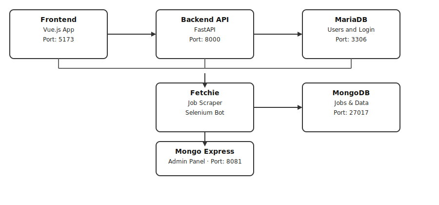

# EZ Sync 🚀

*A job search platform that collects LinkedIn job posts automatically and shows them with smart filters and a modern web interface.*

## Table of Contents

- 📖 [Overview](#overview)
- ✨ [Key Features](#key-features)
- 🏛️ [Architecture](#architecture)
- 🛠️ [Tech Stack](#tech-stack)
- 🤝 [Contributing](#contributing)
- 📄 [License](#license)

## 📖 Overview

EZ Sync helps you find tech jobs more easily. Instead of searching on many different websites, you can use one platform to see job opportunities from LinkedIn. The app collects jobs automatically and organizes them by categories and experience levels.

The platform has three main parts: a Vue.js web app for users, a FastAPI backend for managing data, and a Selenium bot that collects job information. Whether you're a new graduate or an experienced developer, EZ Sync makes job searching faster and more organized.

## ✨ Key Features

- **Smart Job Collection:** Automatically gets job posts from LinkedIn. It can filter by job type, experience level (entry/mid/senior), location, and how recent the posts are. This keeps your job list fresh and relevant.
- **Easy Search & Filters:** Find jobs quickly with category filters, experience level selection, location search, and keyword matching. The page loads more jobs as you scroll down for better speed.
- **Secure Login System:** Safe user accounts with JWT tokens (a type of secure login), password protection, and session management that meets high security standards.
- **Mobile-Friendly App:** Works like a mobile app with offline features, responsive design that fits any screen, and notifications. Built with Vue.js for a smooth experience.
- **Two Database System:** Uses MariaDB for user accounts (needs high accuracy) and MongoDB for job data storage (allows flexible searching).

## 🏛️ Architecture

EZ Sync uses a **Microservices Architecture** where different parts work separately and can grow independently:

**Main Parts:**

- **Frontend App:** The website that users see and interact with. Built with Vue.js 3 and TypeScript for better code quality.
- **Backend API:** The server that handles user login and job searches. Built with FastAPI for speed and reliability.
- **Job Scraper (Fetchie):** A bot that visits LinkedIn and collects job information automatically using Selenium.
- **Databases:** MariaDB stores user information safely, while MongoDB stores job data with flexible searching options.

## 🛠️ Tech Stack

**Frontend (Website):**
- **Vue.js 3.5.17:** Modern web framework for building user interfaces
- **TypeScript:** Helps catch errors in code before they happen
- **Vite 7.0.0:** Fast build tool for development
- **PrimeVue 4.3.7:** Ready-made UI components like buttons and forms
- **Tailwind CSS 4.1.11:** Styling framework for quick design
- **Pinia 3.0.3:** Manages app data and state
- **Axios 1.11.0:** Sends requests to the server

**Backend (Server):**
- **Python 3.11+:** Main programming language
- **FastAPI 0.116.0:** Fast API framework with automatic documentation
- **SQLAlchemy 2.0.41:** Manages MariaDB database connections
- **Beanie 1.30.0:** Manages MongoDB database connections
- **Pydantic 2.11.7:** Validates and organizes data
- **Python-JOSE & Passlib:** Handle secure login tokens and passwords

**Databases:**
- **MariaDB:** Stores user accounts and login information
- **MongoDB:** Stores job data with flexible structure

**Tools:**
- **Selenium WebDriver:** Controls web browser to collect job data
- **Docker:** Runs all parts of the app in containers for easy setup

## 🤝 Contributing

Want to help improve EZ Sync? Here's how:

1. **Fork the project** and create your own branch from `main`
2. **Follow code style:** Use ESLint for frontend, follow Python standards for backend
3. **Write tests** for new features
4. **Update documentation** when you make changes
5. **Test with Docker** to make sure everything works
6. **Create a pull request** with a clear description of your changes

**Development Tips:**
- Use clear commit messages that explain what you changed
- Test your changes in both development and production modes
- Keep the same coding patterns as the existing code
- Make sure your code works on different computers

## 📄 License

This project uses the MIT License - see the [LICENSE](LICENSE) file for full details.
Copyright (c) 2025 Nyx
